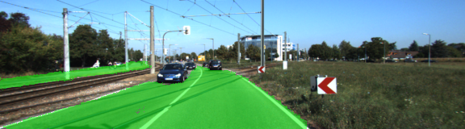
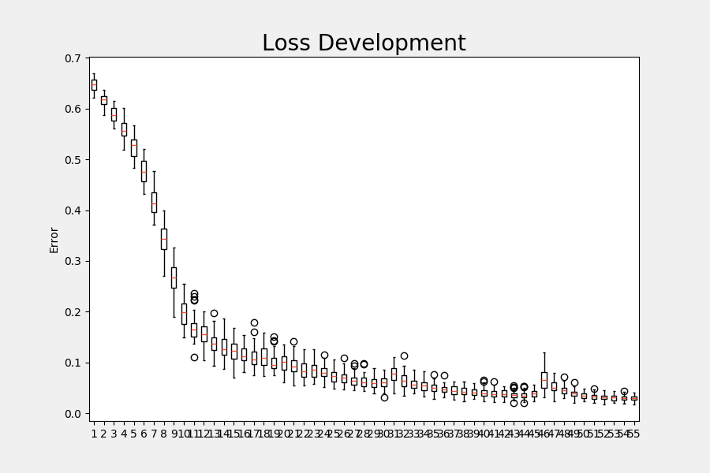

# Self-Driving Car Engineer Nanodegree Program
# *CarND-Semantic-Segmentation-Project*

## Introduction

The goal of this project is to construct a fully convolutional neural network (FCN-8 architecture) 
based on the VGG-16 image classifier architecture for performing semantic segmentation to identify 
drivable road area from an car dashcam image (trained and tested on the KITTI data set).

In addition to the basic requirements, this implementation considers saving and loading trained models, 
apply the inference onto pictures and/or movies. The implementation is able to identify two or three 
classes on pictures and uses augmentation.

### 2-class detection
<p align="center">

</p>

### 3-class detection
<p align="center">

</p>


## Architecture

The fully connected network FCN-8 for semantic segmention composes of a pre-trained, frozen VGG-16 
detection network and a successive, additionally implemented deep neural network consisting of 
conv2dtranspose-layers to upsample the features and of conv2d1x1-layers to add the skipped connections to it.
Each convolution and transpose convolution layer includes a regularizer.

## Implementation

The project consists of the following files:

* **main.py**:  Run control, FCN generation, training definition, movie generation for 2- and 3-classes
* **helper.py**:    Augmentation functions, vgg load function, gen_batch-function for 2- and 3-classes, 
                inference on pictures for 2- and 3-classes
* **project_test.py**:  Test of implemented functions in main.py

The file **main.py** contains the procedure `load_vgg` (l.38-65) for loading the VGG-16 model and to define the 
tensors for input, keep-prob, and layers 3,4,7 for the skip connections. The procedure `layers` (l.69-94) connects the
VGG-16 model with the conv2dtranspose-layers to upsample the features and uses conv2d1x1-layers to integrate the 
skip connections. The optimization function Adam and minimizer Cross-Entropy-Loss are selected in the function `optimizer` (l.98-118)
and the training is performed in procedure `train_nn` (l.122-182). Beside the training in dependence on epochs and batch-sizes, 
loss information are printed out and collected in an image which is saved in the current directory. 
The procedures `gen_mov_pic` (l.186-211), `gen_3class_mov_pic` (l.213-247) and `gen_mov_pic_wrapper` (l.249-270) are implemented 
additionally to enable movie generation for 2-class and 3-class inference.
In the function `run` (l. 274-397) the number of classes (l.276) and types of generation (l.296-298) can be selected. Afterwards it 
either trains an according model (l.311-352) or loads an existing one (l.354-370) and optionally generates inferred images (l.373-385) 
or a movie (l.389-397).

The file **helper.py** has been extended by the augementation procedures (`random_flip`: randomized flipping, 
`random_gamma`: randomized coloring , `random_shear`: randomized transforming, `augment_image`: augmentation control) and by functions 
for 3-class detection and image inference. The 3-class detection function `gen_3class_batch_function` is an adopted version of the already
implemented function `gen_batch_function` for image batch generation. The 3-class inference functions `gen_3class_test_output` and 
`save_3class_inference_samples` are transferred versions of the already existing functions for generating the test image output.

## Training

For **2-class inference** training, the following parameter seemed to be very promising:

* Epochs:   56
* Batch-Size: 5
* Keep-Prob.: 0.75
* Learn-Rate: 0.0001

Loss-Development:
<p align="center">

</p>

For **3-class inference** training, the following parameter delivered better results, especially for the blue colored:

* Epochs:   200
* Batch-Size: 10
* Keep-Prob.: 0.75
* Learn-Rate: 0.0001

Loss-Development:
<p align="center">

</p>

## Results

Example samples with 2-class inference:
<p align="center">

</p>
<p align="center">

</p>

The according samples with 3-class inference:
<p align="center">

</p>
<p align="center">

</p>

Example movie:

* Movie from advanced lane line, 2-class inference [YouTube Video] (https://www.youtube.com/watch?v=WnQA4dbUMDo)
* Movie from advanced lane line, 3-class inference [YouTube Video] (https://www.youtube.com/watch?v=GDyUgl0csds)

---

# **Original Udacity README**


# Semantic Segmentation
### Introduction
In this project, you'll label the pixels of a road in images using a Fully Convolutional Network (FCN).

### Setup
##### Frameworks and Packages
Make sure you have the following is installed:
 - [Python 3](https://www.python.org/)
 - [TensorFlow](https://www.tensorflow.org/)
 - [NumPy](http://www.numpy.org/)
 - [SciPy](https://www.scipy.org/)
##### Dataset
Download the [Kitti Road dataset](http://www.cvlibs.net/datasets/kitti/eval_road.php) from [here](http://www.cvlibs.net/download.php?file=data_road.zip).  Extract the dataset in the `data` folder.  This will create the folder `data_road` with all the training a test images.

### Start
##### Implement
Implement the code in the `main.py` module indicated by the "TODO" comments.
The comments indicated with "OPTIONAL" tag are not required to complete.
##### Run
Run the following command to run the project:
```
python main.py
```
**Note** If running this in Jupyter Notebook system messages, such as those regarding test status, may appear in the terminal rather than the notebook.

### Submission
1. Ensure you've passed all the unit tests.
2. Ensure you pass all points on [the rubric](https://review.udacity.com/#!/rubrics/989/view).
3. Submit the following in a zip file.
 - `helper.py`
 - `main.py`
 - `project_tests.py`
 - Newest inference images from `runs` folder  (**all images from the most recent run**)
 
 ### Tips
- The link for the frozen `VGG16` model is hardcoded into `helper.py`.  The model can be found [here](https://s3-us-west-1.amazonaws.com/udacity-selfdrivingcar/vgg.zip)
- The model is not vanilla `VGG16`, but a fully convolutional version, which already contains the 1x1 convolutions to replace the fully connected layers. Please see this [forum post](https://discussions.udacity.com/t/here-is-some-advice-and-clarifications-about-the-semantic-segmentation-project/403100/8?u=subodh.malgonde) for more information.  A summary of additional points, follow. 
- The original FCN-8s was trained in stages. The authors later uploaded a version that was trained all at once to their GitHub repo.  The version in the GitHub repo has one important difference: The outputs of pooling layers 3 and 4 are scaled before they are fed into the 1x1 convolutions.  As a result, some students have found that the model learns much better with the scaling layers included. The model may not converge substantially faster, but may reach a higher IoU and accuracy. 
- When adding l2-regularization, setting a regularizer in the arguments of the `tf.layers` is not enough. Regularization loss terms must be manually added to your loss function. otherwise regularization is not implemented.
 
### Using GitHub and Creating Effective READMEs
If you are unfamiliar with GitHub , Udacity has a brief [GitHub tutorial](http://blog.udacity.com/2015/06/a-beginners-git-github-tutorial.html) to get you started. Udacity also provides a more detailed free [course on git and GitHub](https://www.udacity.com/course/how-to-use-git-and-github--ud775).

To learn about REAMDE files and Markdown, Udacity provides a free [course on READMEs](https://www.udacity.com/courses/ud777), as well. 

GitHub also provides a [tutorial](https://guides.github.com/features/mastering-markdown/) about creating Markdown files.
